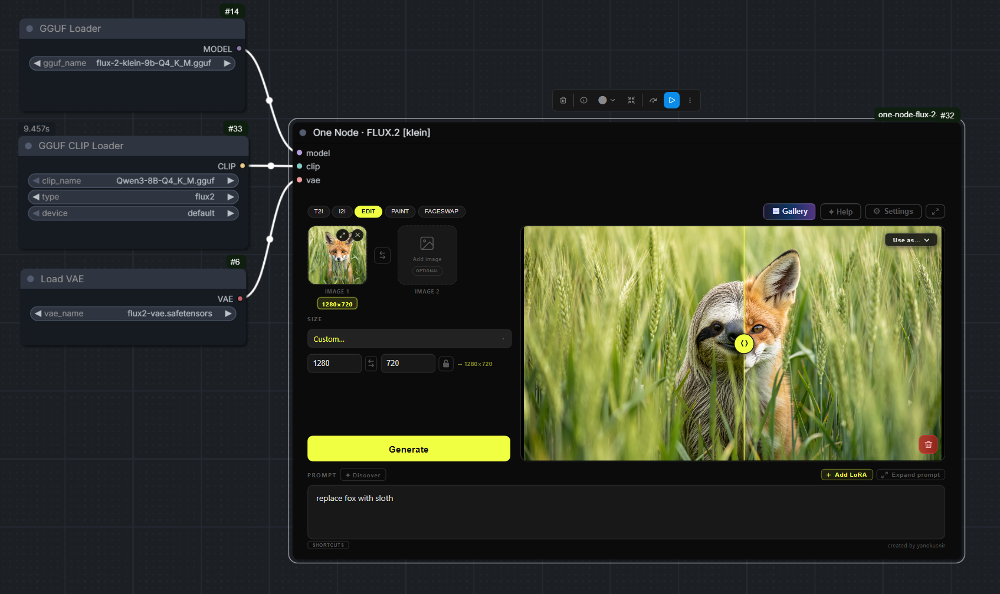

# One Node · FLUX.2 [klein]

A ComfyUI custom node that wraps the full FLUX.2 [klein] workflow into a single self-contained UI widget. No graph to build, no spaghetti wires to connect, just one powerful node with everything inside.

> *One Node to rule them all, One Node to find them,*
> *One Node to bring them all, and in ComfyUI bind them.*
>
> *— J.R.R. Tolkien, probably, if he used ComfyUI*

![One Node · FLUX.2 [klein]](assets/one-node-flux-2-klein.gif)

---

## Tutorial

[](https://youtu.be/L4ItbBWXqCo)

▶ [Watch on YouTube](https://youtu.be/L4ItbBWXqCo)

▶ [See the latest update](https://youtu.be/Vsp1tDFipHE)

The node has been updated since the tutorial was recorded - check the [Changelog](#changelog) for new features.

---

## What it does

The node has 6 modes, switchable with a single click:

**T2I** - standard text to image generation.

**I2I** - good for creating variations or gently nudging an image in a different direction.

**EDIT** - load one or two reference images and describe the change.

**PAINT** - three tools in one:
- Sketch: a full canvas with layers, brushes, shapes and more. Draw something and generate from it.
- Inpaint: paint a mask over the area you want to change, write what should be there instead.
- Outpaint: expand the image in any direction by dragging the edges.

**FACESWAP** - swap a face from a source image onto a target. Requires a Faceswap LoRA.

**POSE** - copy the pose from one image onto the character from a reference image. Requires the DWPose preprocessor node and a RefControl pose LoRA (a 9B LoRA only for now).

---

## Installation

Clone this repo into your ComfyUI `custom_nodes` folder:

```
git clone https://github.com/yanokusnir-ai/one-node-flux-2-klein.git
```

You need one additional custom node for inpaint and outpaint modes:
[ComfyUI-Inpaint-CropAndStitch](https://github.com/lquesada/ComfyUI-Inpaint-CropAndStitch) by lquesada. Just clone it into the same folder:

```
git clone https://github.com/lquesada/ComfyUI-Inpaint-CropAndStitch.git
```

For POSE mode you also need [comfyui_controlnet_aux](https://github.com/Fannovel16/comfyui_controlnet_aux) by Fannovel16, which provides the DWPose preprocessor. On the Windows portable build, run these two commands from your `ComfyUI_windows_portable` folder, one after the other:

```
git clone https://github.com/Fannovel16/comfyui_controlnet_aux ComfyUI/custom_nodes/comfyui_controlnet_aux
```

```
python_embeded\python.exe -s -m pip install -r ComfyUI/custom_nodes/comfyui_controlnet_aux/requirements.txt
```

On other setups (venv, ComfyUI Desktop, Linux/Mac), follow the install instructions in the [comfyui_controlnet_aux readme](https://github.com/Fannovel16/comfyui_controlnet_aux#installation).

Restart ComfyUI. The node appears as **One Node · FLUX.2 [klein]**.

---

## Models

This node works with any FLUX.2 [klein] model officially released by Black Forest Labs.

You will find all officially released FLUX.2 [klein] models on the [Black Forest Labs HuggingFace page](https://huggingface.co/collections/black-forest-labs/flux2). Pick the variant that fits your VRAM and use case. You will need a diffusion model, a matching text encoder, and the VAE.

The Faceswap LoRA is required for the Faceswap mode, and the Pose LoRA for the POSE mode. The BiRefNet model is optional, only needed for the Remove Background feature in PAINT mode.

**Text encoder** (place in `models/text_encoders/`)
- [qwen_3_8b for 9b models](https://huggingface.co/Comfy-Org/vae-text-encorder-for-flux-klein-9b/tree/main/split_files/text_encoders)
- [qwen_3_4b for 4b model](https://huggingface.co/Comfy-Org/vae-text-encorder-for-flux-klein-4b/tree/main/split_files/text_encoders)

**VAE** (place in `models/vae/`)
- [flux2-vae](https://huggingface.co/Comfy-Org/vae-text-encorder-for-flux-klein-9b/tree/main/split_files/vae)

**Faceswap LoRA** (place in `models/loras/`)
- [BFS Head Swap v1 (9b)](https://huggingface.co/Alissonerdx/BFS-Best-Face-Swap/blob/main/bfs_head_v1_flux-klein_9b_step3500_rank128.safetensors)
- [BFS Head Swap v1 (4b)](https://huggingface.co/Alissonerdx/BFS-Best-Face-Swap/blob/main/bfs_head_v1_flux-klein_4b.safetensors)

**Pose LoRA** (place in `models/loras/`) — for POSE mode
- [RefControl v2 Poses (9b)](https://huggingface.co/thedeoxen/refcontrol-FLUX.2-klein-9B-reference-pose-lora/blob/main/refcontrol_v2_poses.safetensors)

**Remove Background** (place in `models/background_removal/`)
- [birefnet](https://huggingface.co/Comfy-Org/BiRefNet/tree/main/background_removal)

---

## License note on FLUX.2 [klein] 9B

This node works with both the 4B and 9B variants of FLUX.2 [klein]. The 4B model is released under Apache 2.0 and can be used freely including commercially.

The 9B model is released under the **FLUX Non-Commercial License** by Black Forest Labs. This means you can use it for personal and research purposes, but commercial use is not permitted. If you use the 9B model, you are responsible for complying with that license.

This node itself is fully open source with no restrictions.

---

## Support

If you find this useful and want to support further development:

[buymeacoffee.com/yanokusnir](https://buymeacoffee.com/yanokusnir)

Thanks. Now go make something cool. :)

---

Built with the help of [Claude](https://claude.ai) by Anthropic.

---

## Changelog

### July 4, 2026

**Reference-guided inpainting**

The inpaint editor now has an optional reference image slot in the top right. Drop an image in and the model uses it to fill the masked area, so you can paint an object, an outfit, or a face straight into a specific spot. Everything outside your mask stays untouched. Leave the slot empty and inpaint works exactly as before. You can also paste a reference straight in with Ctrl+V while the editor is open.

**Batch generation**

Generate up to 4 images in a single run. Works in Text to Image, Image to Image, Edit, Faceswap and Pose. Inpaint and Outpaint run one image at a time, because of how the result is merged back into the original.

**Node output and prompt input**

The node now has an image output, so your result can flow into the rest of your graph, like an upscaler or any other node. It also has a prompt input, so you can feed it a prompt from another node.

**Set image as output from the gallery**

Open any image in the gallery and push it to the node's output with the new "Set as output" button.

**Auto-save toggle**

You can now turn off auto-save. When it's off, results show up as a preview first and you hit Save to keep only the ones you want.

**Canvas-like zoom and pan**

Scroll to zoom and middle-mouse drag to pan while hovering over the node, just like the rest of the ComfyUI canvas.

---

### June 26, 2026

**New POSE mode**

Copy the pose from one image onto the character from a reference image. A DWPose skeleton drives the pose while the reference image drives the appearance, through a RefControl pose LoRA. Requires the comfyui_controlnet_aux node and a RefControl pose LoRA, see the Installation and Models sections.

**Bigger preview layout**

A new layout toggle in the top bar (just right of the Settings button) moves the prompt into the sidebar so the preview window gets the full height, which is handy for portrait images. The classic wide-prompt layout stays the default.

**Keep GGUF connected when toggling External Models off**

The External Models toggle is now the single source of truth. Turning it off keeps your external loader wired but uses the internal dropdowns, so you can switch between the built-in models and an external setup without reconnecting anything.

**Per-slot LoRA on/off toggle**

Each LoRA slot now has a switch, so you can deactivate a LoRA while keeping it loaded, without losing its strength value. This replaces the old per-slot clear button. Thanks to @triatomic for the contribution.

**Paint shortcuts and inpaint marquee**

`[` and `]` change the brush size in the Sketch editor (`{` / `}` for bigger steps), and the inpaint mask editor gains a rectangle marquee tool (`R`) for masking a rectangular area. Thanks to @triatomic.

**Outpaint seam feather**

A Seam feather slider in the outpaint editor controls how far the mask fades into the original, so you can soften visible seams. Defaults to Auto (the previous behaviour).

**More reliable LoRA strength drag**

The drag-to-scrub on LoRA strength now works consistently, including fast flicks and drags started near the edge of the field. Thanks to @triatomic.

---

### June 23, 2026

**More LoRA slots**

The LoRA panel now starts with 3 slots and you can add up to 6 with the "+ Add slot" button (and remove extras with "Remove last slot"). The panel was also redesigned to be cleaner, with collapsible trigger words and a scrollable list.

**Downscale reference images (new Settings option)**

Added a toggle in Settings to downscale input images before they enter the model, for EDIT and Sketch modes. Lower MP means faster generation and lower VRAM, which helps avoid out-of-memory freezes on large images. On by default at 1 MP (matching the previous behaviour); turn it off for maximum fidelity when your GPU can handle the full resolution.

**Custom prompts and settings now survive reinstalls**

Your custom Discover prompts, LoRA trigger words and T2I templates are now stored in the ComfyUI user folder instead of inside the node folder, so they are no longer lost when you update or reinstall the node.

**Paste in Paint mode**

You can now paste an image from your clipboard while the Sketch canvas is open, and it drops in as a new layer.

**Drag to change LoRA strength**

Click and drag horizontally on a LoRA strength value to scrub it, just like native ComfyUI nodes. Clicking still lets you type a value, and the whole number is selected on focus.

**Symlinked model folders are now detected**

The model scanner now follows symbolic links, so LoRAs and other models stored on another drive via symlinks are correctly picked up.

---

### June 22, 2026

**Paste from clipboard**

You can now paste images directly from your clipboard (Ctrl+V) while hovering over the node. In Edit and Faceswap mode the image goes into the first empty slot, then the second if the first is already taken.

**Sketch improvements**

- Added fullscreen mode - hit the expand button in the Sketch toolbar to go fullscreen.
- Brush size limit increased from 200 to 500px.
- Added aspect ratio lock button next to the canvas size inputs.

**Gallery right-click**

Right-clicking any thumbnail in the gallery grid now shows a quick "Use as..." context menu.

---

### June 20, 2026

**Negative LoRA strength**

LoRA strength now accepts negative values - useful for concept sliders and suppressing specific styles or features.

---

### June 19, 2026

**External loaders (GGUF support)**

The node now has optional model, clip, and VAE input slots. Enable them in Settings under "External model/clip/vae inputs" and connect any loader you want - including GGUF. When a loader is connected, the corresponding dropdown in Settings is automatically dimmed.



**Refresh models**

Added a "↻ Refresh models" button in Settings and in the Add LoRA panel. No more restarting ComfyUI after adding new models or LoRAs to your ComfyUI directories - just hit the button.

**Tablet and pen support**

The Sketch canvas now supports tablet input. Pen pressure controls brush size automatically.

---

### June 18, 2026

Initial release.
